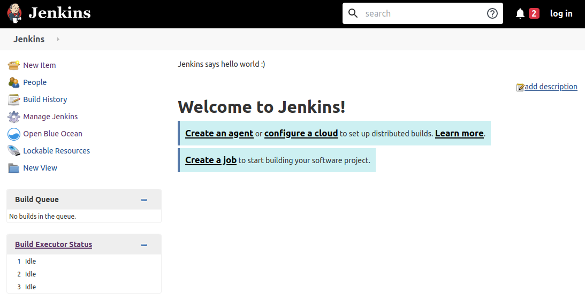

# Jenkins

## Open in google cloud shell

[](https://console.cloud.google.com/cloudshell/editor?cloudshell_git_repo=https://github.com/icp-prg/edu-ci.git)

Spin up the Jenkins server by running:
`docker-compose up -d` Jenkins is running on port
8080

Username: admin Password: `cafepassword`





* Open Blue Ocean(왼쪽의 'Open Blue Ocean(블루 오션 열기)' 링크를 클릭합니다.)

* 새 파이프라인을 만듭니다.
* GitHub에 연결합니다.

    * 'GitHub'를 클릭합니다.
    * 'Create an access token here'를 클릭합니다.
    
    * Github page 에서 토큰을 생성합니다.

    * Jenkins로 돌아가. 토큰을 Jenkins에 붙여넣고 Connect를 클릭합니다.
    
    * GitHub 조직을 선택하십시오.
    
    * 파이프라인을 선택합니다.
    
    * 에이전트를 docker를 선택합니다.

    * 이미지에 'maven:3.3.9-jdk-8' 를 입력합니다.

    * 새로운 Stage를 만들고 Step을 추가합니다.
    
    * Step 추가시 셸 스크립트를 선택합니다.
    
    * `mvn package`
    
    * [Commit] -> [Save] & [Run]을 선택합니다.


* 파이프라인 예제
```
pipeline {
  agent {
    docker {
      image 'maven:3.3.9-jdk-8'
    }

  }
  stages {
    stage('build') {
      parallel {
        stage('Test') {
          steps {
            sh 'mvn test -Dtest=!*API*'
          }
        }

        stage('build') {
          steps {
            sh 'mvn -B -DskipTests=true package'
          }
        }
      }
    }
  }
}
```
